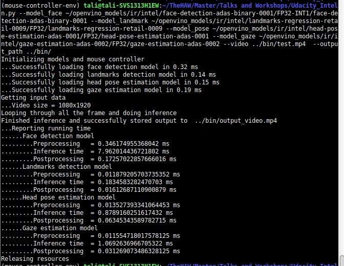
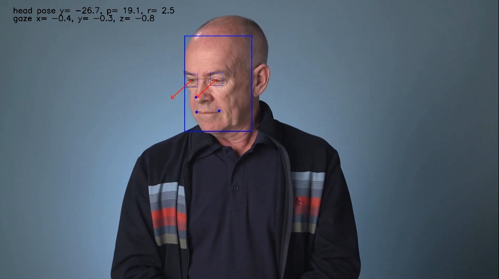

# Computer Pointer Controller

This project aims to use gaze detection model to control the mouse pointer of the computer. To do so, it takes advantage of 4 models including
  * [Face detection](https://docs.openvinotoolkit.org/latest/_models_intel_face_detection_adas_binary_0001_description_face_detection_adas_binary_0001.html)
  * [Facial landmarks detection](https://docs.openvinotoolkit.org/latest/_models_intel_landmarks_regression_retail_0009_description_landmarks_regression_retail_0009.html)
  * [Head pose estimation](https://docs.openvinotoolkit.org/latest/_models_intel_head_pose_estimation_adas_0001_description_head_pose_estimation_adas_0001.html )
  * [Gaze estimation](https://docs.openvinotoolkit.org/latest/_models_intel_gaze_estimation_adas_0002_description_gaze_estimation_adas_0002.html )


## Project Set Up and Installation

The project code is structured as following:

**/bin** : contains the given input video *demo.mp4*, a shorter video of 10s cut from the demo.mp4 for testing *test.mp4*

**/result** : a demo output video *demo_output.mp4*, a demo command line output *cmd.jpg*, an output intermediate result *output.jpg*

**/requirements.txt** : contains a list of all necessary dependencies to run this application

**/src/** : contains 4 model classes (face_detection.py, facial_landmarks_detection.py, gaze_estimation.py and head_pose_estimation.py), the input_feeder.py (modified), mouse_controller.py (modified) and the main.py.

**README.md** : contains project summary

The models themselves are downloaded corresponding to the link in the project description. In my case I put them into the default folder of ir of openvino which is **~/openvino_models/ir/intel/**

The project is tested on my local machine with installed **openvino_2020.2.120** and within the virtual environment.

```console
python3 -m venv mouse-controller-env
source mouse-controller-env/bin/activate
pip install -r requirements.txt
```

## Demo
To run the application from the project directory:
```console
cd /src
python3 main.py --model_face [face detection model path] \
--model_landmark [landmarks detection model path] \
--model_pose [head pose estimation model path] \
--model_gaze [gaze estimation model path] \
--video [video path] \
--output_path [output path] \
```
As new version of openvino will search for available extensions itself, I did not have to add extensions my own. But if you use an old version, there will be some unsupported_layers reported, please add extensions by
```console
--extensions /opt/intel/openvino/deployment_tools/inference_engine/lib/intel64/libcpu_extension_sse4.so
```

There are some other parameters which can be passed such as --threshold_face_detection, --device,  --extensions, --mouse_precision or --mouse_speed. In the simple case, all default values are used! Use --show_frame to show intermediate result every 5 frames. Use --debug flag to show more log data.

E.g.: Running the application with my project setup above on 'CPU', which results the /bin/output_video.mp4. I then removed it to  **/result/demo_output.mp4**
```console
python3 main.py --model_face ~/openvino_models/ir/intel/face-detection-adas-binary-0001/FP32-INT1/face-detection-adas-binary-0001 \
 --model_landmark ~/openvino_models/ir/intel/landmarks-regression-retail-0009/FP32/landmarks-regression-retail-0009 \
 --model_pose ~/openvino_models/ir/intel/head-pose-estimation-adas-0001/FP32/head-pose-estimation-adas-0001 \
 --model_gaze ~/openvino_models/ir/intel/gaze-estimation-adas-0002/FP32/gaze-estimation-adas-0002 \
 --video ../bin/demo.mp4 --output_path ../bin/
```



## Documentation

  * Possible command line arguments: Please refer to the main() in main.py to have an overview about possible arguments with its type and so on. There is a description about each parameter in 'help'. Here is a short description of those parameters. Highlighted means required parameters which have no default value which the user has to pass!
      * **--model_face, --model_landmark, --model_pose, --model_gaze**: Path to the model structure and weights. E.g. If the model weights and structure are at /intel/model/model_x.bin and /intel/model/model_x.xml -> please pass /intel/model/model_x without .bin or .xml ending. The application will take care of getting those files correctly.
      * --device: Device name as defined by intel. Default is CPU.
      * --threshold_face_detection: As face detection model provides also a confidence at outpput, user can also pass the confidence here to filter the poor result. Default is 0.5.
      * --extensions: Path to extension if needed. Note that the new version of openvino will automatic search for available extensions, otherwise user has to add it his/her own.
      * **--video**: Path to video input or 'cam' if using camera. Image is not accepted as input.
      * --output_path: Path to store output video. Default is None, mean no output is stored.
      * --mouse_speed, --mouse_precision: Value of mouse speed and precision as defined in mouse_controller.py. ['slow', 'fast', 'medium'] and ['high', 'low', 'medium']
      * --show_frame: Flag to show intermediate results.
      * --debug: Flag to show more detailed log event.
  * Inferencing pipeline: The application uses synchronous inference. Face is detected from the ModelFaceDetection. If more or less than 1 face is detected, the frame is skipped for further process. Detected face is then passed to ModelLandmarksDetection and ModelHeadPoseEstimation to get the eyes and head pose, which are then passed to ModelGazeEstimation to have the final gaze_vector. (x,y) from gaze_vector is then passed to MouseController. The frame is drawn with the head pose (y,p,r), gaze vector (x,y,z), gaze vector as an arrow line from center eye with norm=25, bounding box around face, eyes and point at nose and left and right corner of mouth . Each model class draws its own output to the frame in draw_output function
  
  * Moving mouse: I modified the MouseController to move mouse to center at initialization since it's better to observe the mouse movement. I also noticed the movement of mouse isn't very accurate, especially with input from camera. One possible reason is each machine has its own setup which cv2 reads, in my case 640x480 even though the real screen size is 1280x720, which leads to the inaccurate mouse movement. Also pyautogui.moveRel blocks 0.1s until response and as such blocks inference next frame. I did not dive deeper into that library and use a naive solution by calling move(x,y) from MouseController only every 10 frames, so that the inference is not blocked too much. You can also comment out the mouse movement if you want to focus more on the intermediate results
  ```python
  #TODO comment the following to deactivate mouse movement
      #if want to focus more on the intermediate result!
      if count%10==0:
          # pyautogui.moveRel blocking 0.1s -> blocking inference -> move only every 10 frames
          mouse_controller.move(gaze[0][0], gaze[0][1])
  ```
  * Intermediate results: The intermediate results can be show if --show_frame is passed and can be stored if the '--output_path' is given. I also show intermediate results only 1/5frames (which is hard-coded) since the head movement used to happen in half second period and showing all frames does not bring so much more information.
  * Running time report: For each model, there are 3 object variables of preprocessing_time, inference_time and postprocessing_time which track the time of preprocessing input, inference and proccessing output. It is accumulated for all frames of the video input. The results are printed out after finishing processing all frames.

## Benchmarks
* I collected the 'running time report' as described above while running on video file /bin/test.mp4 (a 10s video split from the original video /bin/demo.mp4). The model running time report is collected independently on each other (see more in each model class). Therefore it makes more sense to compare time of each model with different precision. The comparison among combination of different models with different precision results from there as well.
* Time is collected in ms. There are a slightly variable result each execution. Below is just one example.
  * Face detection model has only 1 precision. Therefore there is no comparison for it
  * Landmarks detection model

|precision | loading time | inference | preprocessing | postprocessing |
| --- | --- | --- | --- | --- |
|FP32 |0.05 | 0.06462526321411133|0.007638692855834961 |0.009402036666870117 |
|FP16 |**0.06** | **0.0641**8132781982422 |0.0077474117279052734|0.009356498718261719 |

  * Head pose estimation model

|precision | loading time | inference | preprocessing | postprocessing |
| --- | --- | --- | --- | --- |
|FP32 |0.07 |0.2566366195678711|0.013198137283325195|0.0461122989654541|
|FP16 |**0.09**| **0.2550**8999824523926 |0.01315927505493164| 0.04545283317565918 |

  * Gaze estimation model

|precision | loading time | inference | preprocessing | postprocessing |
| --- | --- | --- | --- | --- |
|FP32 |0.09 |0.3130059242248535|0.007975578308105469|0.022005796432495117|
|FP16 |**0.10**| **0.3123**7339973449707|0.007644176483154297|0.022309064865112305  
|INT8 |**0.12**|**0.2803**919315338135 |0.007623195648193359| 0.02169322967529297 |    

## Results

The loading time of FP16 or INT8 are higher than FP32 for all models. It seems surprised at first sight since the FP16 or INT8 model size is smaller than FP32. But as CPU is optimized for FP32, it could be the reason while loading FP32 takes lower time than others on my CPU. The loading time will be different if running on e.g. GPU. The inference time of FP16 is lower than FP32 in all models. The inference time of INT8 is lower than FP16 in gaze estimation model. This means that the lower the precision is (the smaller the #bits need to be used to store the weights), the faster is the inference, which also leads to higher fps. Even though quantization does not reduce the number of operations (#operations), operating on a lower precision values does cost less computational power and as that results faster inference, higher fps.
